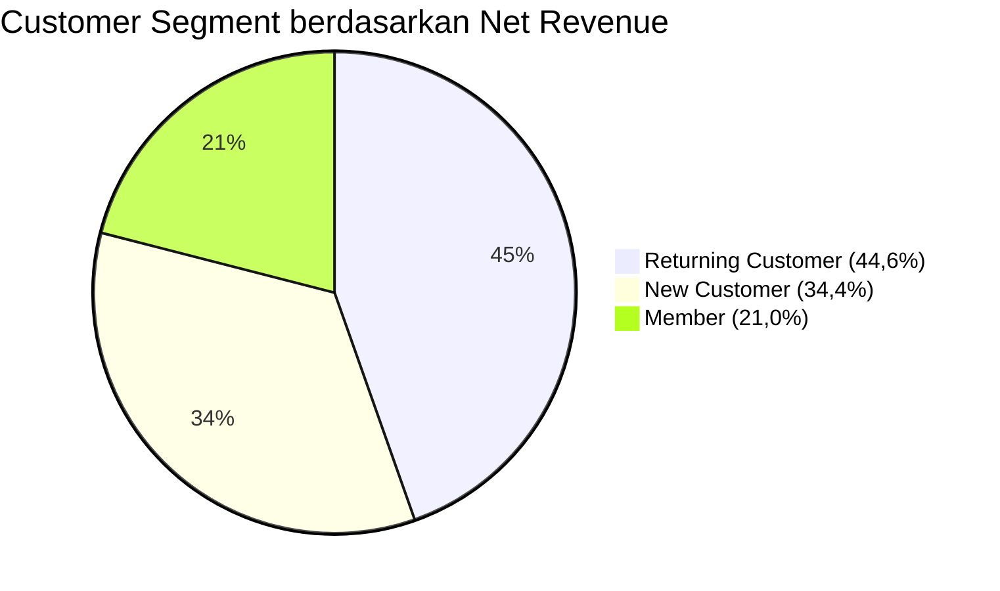
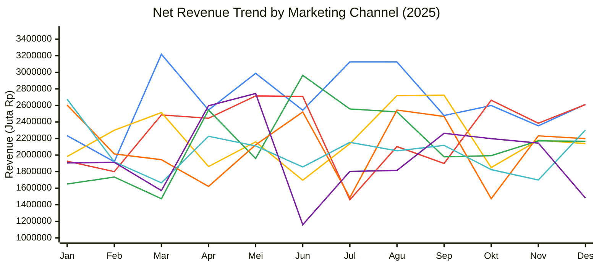
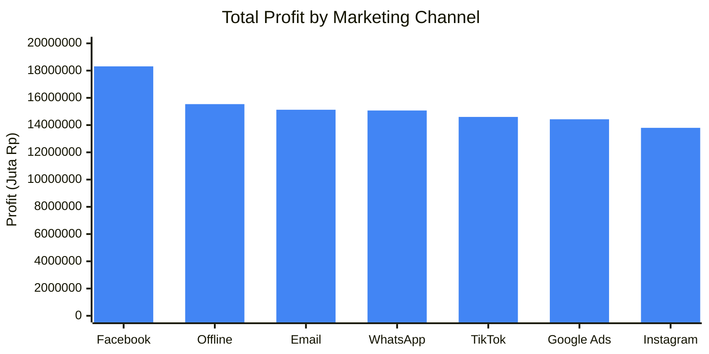
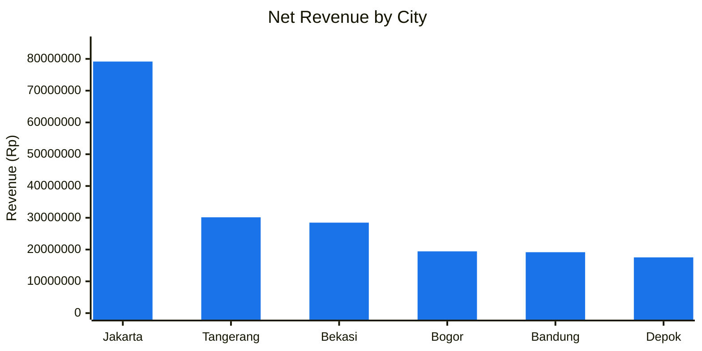
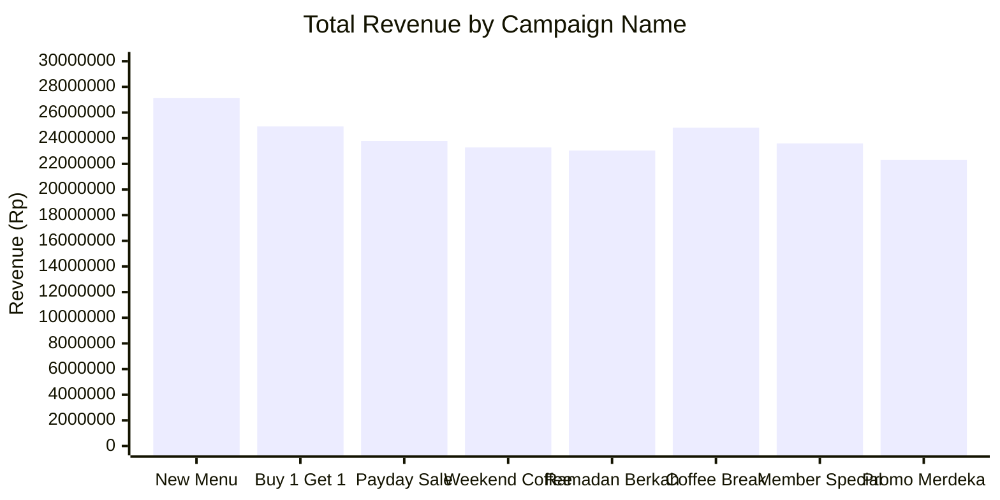
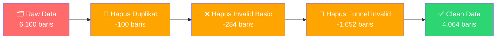

<![CDATA[<div align="center">

# ☕ Kopi Tuku — Campaign Performance Dashboard

### 📅 Periode: 1 Januari 2025 – 31 Desember 2025


</div>

---

## 📊 KPI Overview

<table>
<tr>
<td align="center" width="25%">

### 💰 Net Revenue
## Rp 193.915.996
▲ Total pendapatan bersih

</td>
<td align="center" width="25%">

### 🧾 Total Transactions
## 4.064
▲ Total transaksi bersih

</td>
<td align="center" width="25%">

### 📈 Profit
## Rp 106.871.060
▲ Total keuntungan

</td>
<td align="center" width="25%">

### 🎯 Profit Margin
## 55,11%
▲ Rasio profit terhadap revenue

</td>
</tr>
</table>

<table>
<tr>
<td align="center" width="20%">

### 🛒 AOV
**Rp 47.716**
<sub>Average Order Value</sub>

</td>
<td align="center" width="20%">

### 📊 ROAS
**0,35**
<sub>Return on Ad Spend</sub>

</td>
<td align="center" width="20%">

### 🖱️ CTR
**10,40%**
<sub>Click-Through Rate</sub>

</td>
<td align="center" width="20%">

### 🔄 Conversion Rate
**25,29%**
<sub>Lead to Conversion</sub>

</td>
<td align="center" width="20%">

### 💸 Total Ad Spend
**Rp 558.122.544**
<sub>Biaya iklan keseluruhan</sub>

</td>
</tr>
</table>

---

## 👥 Customer Segment — Net Revenue



| Segment | Net Revenue | Share |
|:---|---:|:---|
| 🔵 **Returning Customer** | Rp 86.462.317 | `████████████████████░░░░░` 44,6% |
| 🟢 **New Customer** | Rp 66.644.962 | `███████████████░░░░░░░░░░` 34,4% |
| 🟠 **Member** | Rp 40.808.717 | `██████████░░░░░░░░░░░░░░░` 21,0% |

---

## 📈 Net Revenue Trend by Marketing Channel (Monthly)



### Monthly Revenue Summary

| Bulan | Revenue | Profit | Orders | ROAS | AOV |
|:---|---:|---:|---:|---:|---:|
| Jan 2025 | Rp 14.977.609 | Rp 8.254.465 | 314 | 0,34 | Rp 47.699 |
| Feb 2025 | Rp 13.601.175 | Rp 7.495.886 | 290 | 0,33 | Rp 46.901 |
| Mar 2025 | Rp 14.870.593 | Rp 8.195.481 | 304 | 0,35 | Rp 48.916 |
| Apr 2025 | Rp 15.839.429 | Rp 8.729.434 | 331 | 0,35 | Rp 47.853 |
| **Mei 2025** 🔺 | **Rp 16.798.521** | **Rp 9.257.998** | **356** | 0,35 | Rp 47.187 |
| Jun 2025 | Rp 15.446.332 | Rp 8.512.800 | 329 | 0,36 | Rp 46.949 |
| Jul 2025 | Rp 14.723.743 | Rp 8.114.556 | 297 | 0,37 | Rp 49.575 |
| **Agu 2025** 🔺 | **Rp 16.878.399** | **Rp 9.302.033** | **343** | 0,36 | Rp 49.208 |
| Sep 2025 | Rp 15.925.385 | Rp 8.776.809 | 312 | 0,38 | Rp 51.043 |
| Okt 2025 | Rp 14.601.412 | Rp 8.047.138 | 328 | 0,31 | Rp 44.516 |
| Nov 2025 | Rp 15.165.654 | Rp 8.358.097 | 321 | 0,34 | Rp 47.245 |
| Des 2025 | Rp 15.511.505 | Rp 8.548.700 | 343 | 0,34 | Rp 45.223 |

> 🔺 **Peak Revenue**: Agustus 2025 (Rp 16,87 Jt) | **Peak Profit**: Agustus 2025 (Rp 9,30 Jt) | **Best ROAS**: September 2025 (0,38)

---

## 📊 Total Profit by Marketing Channel



| Rank | Channel | Revenue | Ad Spend | Profit | ROAS | CTR |
|:---:|:---|---:|---:|---:|:---:|:---:|
| 🥇 | **Facebook** | Rp 33.225.216 | Rp 98.530.039 | Rp 18.311.105 | 0,34 | 10,34% |
| 🥈 | **Offline** | Rp 28.195.478 | Rp 79.182.064 | Rp 15.539.099 | 0,36 | 10,50% |
| 🥉 | **Email** | Rp 27.446.223 | Rp 77.842.470 | Rp 15.126.179 | 0,35 | 10,24% |
| 4 | **WhatsApp** | Rp 27.346.975 | Rp 76.696.765 | Rp 15.071.462 | 0,36 | 10,56% |
| 5 | **TikTok** | Rp 26.490.399 | Rp 80.160.677 | Rp 14.599.403 | 0,33 | 10,59% |
| 6 | **Google Ads** | Rp 26.175.454 | Rp 75.531.590 | Rp 14.425.822 | 0,35 | 10,13% |
| 7 | **Instagram** | Rp 25.036.251 | Rp 70.178.939 | Rp 13.797.990 | 0,36 | 10,46% |

### Channel Profit Distribution

| Channel | Profit Share | Visual |
|:---|---:|:---|
| Facebook | 17,1% | `██████████████████░░░░░░░` |
| Offline | 14,5% | `███████████████░░░░░░░░░░` |
| Email | 14,2% | `██████████████░░░░░░░░░░░` |
| WhatsApp | 14,1% | `██████████████░░░░░░░░░░░` |
| TikTok | 13,7% | `██████████████░░░░░░░░░░░` |
| Google Ads | 13,5% | `█████████████░░░░░░░░░░░░` |
| Instagram | 12,9% | `█████████████░░░░░░░░░░░░` |

---

## 🏷️ Campaign Type Performance

```mermaid
---
config:
    xyChart:
        width: 800
        height: 400
---
xychart-beta
    title "Net Revenue & Profit by Campaign Type"
    x-axis ["Awareness", "Conversion", "Engagement", "Retention"]
    y-axis "Amount (Rp)" 0 --> 50000000
    bar "Net Revenue" [47264169, 46371575, 45839785, 44864228]
    bar "Profit" [26048247, 25556315, 25263244, 24725591]
```



| Campaign Type | Net Revenue | Profit | Quantity | Ad Spend | ROAS |
|:---|---:|---:|---:|---:|:---:|
| 🟢 **Awareness** | Rp 47.264.169 | Rp 26.048.247 | 2.368 | Rp 134.212.612 | 0,35 |
| 🔵 **Conversion** | Rp 46.371.575 | Rp 25.556.315 | 2.286 | Rp 135.663.406 | 0,34 |
| 🟠 **Engagement** | Rp 45.839.785 | Rp 25.263.244 | 2.290 | Rp 131.700.252 | 0,35 |
| 🔴 **Retention** | Rp 44.864.228 | Rp 24.725.591 | 2.242 | Rp 129.312.252 | 0,35 |

### Top 5 Campaign × Type Combinations (by Revenue)

| # | Campaign | Type | Revenue | Profit | ROAS |
|:---:|:---|:---|---:|---:|:---:|
| 1 | 🏆 **New Menu Launch** | Awareness | Rp 7.662.753 | Rp 4.223.099 | 0,37 |
| 2 | **New Menu Launch** | Retention | Rp 7.168.102 | Rp 3.950.485 | 0,36 |
| 3 | **Buy 1 Get 1** | Conversion | Rp 6.922.032 | Rp 3.814.878 | 0,38 |
| 4 | **Payday Sale** | Awareness | Rp 6.955.569 | Rp 3.833.358 | 0,37 |
| 5 | **New Menu Launch** | Engagement | Rp 6.723.402 | Rp 3.705.404 | 0,31 |

---

## ☕ Product Performance

```mermaid
---
config:
    xyChart:
        width: 800
        height: 400
    themeVariables:
        xyChart:
            plotColorPalette: "#6F4E37"
---
xychart-beta
    title "Revenue & Profit by Product"
    x-axis ["Kopi Mocha", "Es Kopi Tuku", "Kopi Susu T.", "Kopi Latte", "Croissant", "Teh Susu", "Kopi Hitam", "Pisang Goreng"]
    y-axis "Amount (Rp)" 0 --> 32000000
    bar "Revenue" [30158596, 29283025, 26208072, 25627248, 23515280, 20312370, 19614546, 19196859]
    bar "Profit"  [16621021, 16138504, 14443789, 14123745, 12959719, 11194549, 10809974, 10579759]
```



| Rank | Product | Revenue | Profit | Orders | Quantity | AOV |
|:---:|:---|---:|---:|---:|---:|---:|
| 🥇 | **Kopi Mocha** | Rp 30.158.596 | Rp 16.621.021 | 516 | 1.230 | Rp 58.447 |
| 🥈 | **Es Kopi Tuku** | Rp 29.283.025 | Rp 16.138.504 | 560 | 1.341 | Rp 52.291 |
| 🥉 | **Kopi Susu Tetangga** | Rp 26.208.072 | Rp 14.443.789 | 522 | 1.250 | Rp 50.207 |
| 4 | **Kopi Latte** | Rp 25.627.248 | Rp 14.123.745 | 471 | 1.122 | Rp 54.410 |
| 5 | **Croissant** | Rp 23.515.280 | Rp 12.959.719 | 521 | 1.234 | Rp 45.135 |
| 6 | **Teh Susu** | Rp 20.312.370 | Rp 11.194.549 | 493 | 1.169 | Rp 41.202 |
| 7 | **Kopi Hitam** | Rp 19.614.546 | Rp 10.809.974 | 482 | 1.142 | Rp 40.694 |
| 8 | **Pisang Goreng** | Rp 19.196.859 | Rp 10.579.759 | 499 | 1.184 | Rp 38.471 |

### Product Revenue Share

| Product | Share | Visual |
|:---|---:|:---|
| Kopi Mocha | 15,6% | `████████████████░░░░░░░░░` |
| Es Kopi Tuku | 15,1% | `███████████████░░░░░░░░░░` |
| Kopi Susu Tetangga | 13,5% | `██████████████░░░░░░░░░░░` |
| Kopi Latte | 13,2% | `█████████████░░░░░░░░░░░░` |
| Croissant | 12,1% | `████████████░░░░░░░░░░░░░` |
| Teh Susu | 10,5% | `███████████░░░░░░░░░░░░░░` |
| Kopi Hitam | 10,1% | `██████████░░░░░░░░░░░░░░░` |
| Pisang Goreng | 9,9% | `██████████░░░░░░░░░░░░░░░` |

---

## 🗺️ Net Revenue by City



| Rank | City | Net Revenue | Share | Visual |
|:---:|:---|---:|---:|:---|
| 🥇 | **Jakarta** | Rp 79.159.244 | 40,8% | `█████████████████████░░░░` |
| 🥈 | **Tangerang** | Rp 30.154.062 | 15,6% | `████████░░░░░░░░░░░░░░░░░` |
| 🥉 | **Bekasi** | Rp 28.470.078 | 14,7% | `███████░░░░░░░░░░░░░░░░░░` |
| 4 | **Bogor** | Rp 19.432.132 | 10,0% | `█████░░░░░░░░░░░░░░░░░░░░` |
| 5 | **Bandung** | Rp 19.164.010 | 9,9% | `█████░░░░░░░░░░░░░░░░░░░░` |
| 6 | **Depok** | Rp 17.536.470 | 9,0% | `█████░░░░░░░░░░░░░░░░░░░░` |

> 📍 **Jakarta** mendominasi dengan **40,8%** dari total revenue — hampir 3x lipat kota terbesar kedua (Tangerang).

---

## 📋 Campaign Detail — Per Campaign Name



| Campaign | Revenue | Profit | Orders | ROAS | Best Type |
|:---|---:|---:|---:|:---:|:---|
| 🏆 **New Menu Launch** | Rp 27.122.345 | Rp 14.948.792 | 594 | 0,33 | Awareness |
| **Buy 1 Get 1** | Rp 24.916.191 | Rp 13.731.828 | 511 | 0,35 | Conversion |
| **Coffee Break** | Rp 24.817.835 | Rp 13.649.504 | 499 | 0,37 | Engagement |
| **Payday Sale** | Rp 23.788.251 | Rp 13.169.603 | 515 | 0,34 | Awareness |
| **Member Special** | Rp 23.596.921 | Rp 13.004.741 | 497 | 0,35 | Conversion |
| **Weekend Coffee** | Rp 23.276.712 | Rp 12.828.277 | 471 | 0,36 | Retention |
| **Ramadan Berkah** | Rp 23.036.470 | Rp 12.695.870 | 493 | 0,34 | Awareness |
| **Promo Merdeka** | Rp 22.304.471 | Rp 12.292.445 | 484 | 0,33 | Engagement |

---

## 🧹 Data Cleaning Process



| Step | Detail | Rows |
|:---|:---|---:|
| 📥 Raw data | Data mentah awal | 6.100 |
| 🔄 Duplikat dihapus | Exact duplicate rows | -100 |
| ❌ Invalid basic dihapus | Missing/invalid records | -284 |
| 🔻 Funnel invalid dihapus | Inconsistent funnel data | -1.652 |
| ✅ **Final clean data** | **Data siap analisis** | **4.064** |
| 📝 Missing kategorikal | Diisi dengan **mode** | — |
| 📝 Missing numerik | Diisi dengan **median** | — |
| 🔢 Metrik turunan | Dihitung ulang (Gross Revenue, Discount, Net Revenue, COGS, Profit, ROAS, CTR, Lead Rate, Conv Rate, AOV) | — |

---

## 📂 Struktur File

```
kopi-tuku-campaign-performance/
│
├── 📄 Dataset_raw.xlsx          # Dataset mentah (dirty) — 6.100 baris
│   ├── Dirty_Data               # Data transaksi dengan masalah kualitas
│   ├── README                   # Deskripsi project & dataset
│   └── Data_Dictionary          # Penjelasan setiap kolom
│
├── 📄 Dataset_Clean.xlsx        # Dataset bersih (clean) — 4.064 baris
│   ├── Clean_Data               # Data transaksi bersih
│   ├── KPI_Summary              # Rangkuman KPI utama
│   ├── Monthly_Summary          # Performa bulanan
│   ├── Campaign_Summary         # Performa per campaign
│   ├── Channel_Summary          # Performa per channel
│   ├── Product_Summary          # Performa per produk
│   └── Cleaning_Log             # Log pembersihan data
│
├── 📊 Kopi_Tuku_Dashboard.pdf   # Dashboard visualisasi (PDF)
│
└── 📖 README.md                 # Dokumentasi & dashboard (file ini)
```

---

## 📖 Data Dictionary

| Kolom | Deskripsi | Tipe |
|:---|:---|:---:|
| `Transaction_ID` | ID unik transaksi | 🔑 Key |
| `Transaction_Date` | Tanggal transaksi | 📅 Date |
| `City` | Kota lokasi transaksi | 📍 Categorical |
| `Campaign_Name` | Nama kampanye pemasaran | 📋 Categorical |
| `Campaign_Type` | Tipe kampanye | 📋 Categorical |
| `Marketing_Channel` | Channel pemasaran | 📋 Categorical |
| `Product` | Nama produk | 📋 Categorical |
| `Size` | Ukuran produk (Regular/Large) | 📋 Categorical |
| `Customer_Segment` | Segmen pelanggan | 📋 Categorical |
| `Payment_Method` | Metode pembayaran | 📋 Categorical |
| `Quantity` | Jumlah item per transaksi | 🔢 Numeric |
| `Discount_Pct` | Persentase diskon (%) | 🔢 Numeric |
| `Ad_Spend` | Biaya iklan (IDR) | 💰 Currency |
| `Impressions` | Jumlah impresi iklan | 🔢 Numeric |
| `Clicks` | Jumlah klik iklan | 🔢 Numeric |
| `Leads` | Jumlah leads | 🔢 Numeric |
| `Conversions` | Jumlah konversi | 🔢 Numeric |
| `Unit_Price` | Harga satuan produk (IDR) | 💰 Currency |
| `Gross_Revenue` | Pendapatan kotor (IDR) | 💰 Currency |
| `Discount_Amount` | Nilai potongan diskon (IDR) | 💰 Currency |
| `Net_Revenue` | Pendapatan bersih (IDR) | 💰 Currency |
| `COGS` | Cost of Goods Sold (IDR) | 💰 Currency |
| `Profit` | Keuntungan (IDR) | 💰 Currency |
| `ROAS` | Return on Ad Spend | 📊 Ratio |

---

## 🛠️ Tools yang Digunakan

| Tool | Kegunaan |
|:---|:---|
| 📊 **Microsoft Excel / Google Sheets** | Data cleaning & analysis |
| 📈 **Looker Studio / Tableau / Power BI** | Visualisasi dashboard |
| 🐍 **Python** *(opsional)* | Analisis lanjutan |

---

## 🚀 Cara Menggunakan

1. **Clone** repository ini:
   ```bash
   git clone https://github.com/<username>/kopi-tuku-campaign-performance.git
   ```
2. Buka `Dataset_raw.xlsx` untuk melihat data mentah dan memulai proses cleaning sendiri
3. Bandingkan hasil cleaning Anda dengan `Dataset_Clean.xlsx`
4. Lihat `Kopi_Tuku_Dashboard.pdf` untuk referensi visualisasi dashboard interaktif

---

## 💡 Key Insights

<table>
<tr>
<td width="50%">

### 🔑 Temuan Utama

- **Jakarta** mendominasi revenue (40,8%)
- **Returning Customer** berkontribusi terbesar (44,6%)
- **Kopi Mocha** adalah produk top revenue
- **Facebook** menghasilkan profit tertinggi
- **New Menu Launch** adalah campaign terbaik

</td>
<td width="50%">

### ⚠️ Area yang Perlu Diperhatikan

- **ROAS 0,35** — Ad spend lebih besar dari revenue
- **Instagram** memiliki profit terendah antar channel
- **Promo Merdeka** memiliki revenue terendah
- Perlu optimasi **budget allocation** antar channel
- **Conversion Rate** bervariasi antar campaign

</td>
</tr>
</table>

---

## 📄 Lisensi

Project ini dibuat untuk keperluan **edukasi dan portfolio**. Dataset bersifat sintetis/dummy dan tidak merepresentasikan data asli Kopi Tuku.

---

<div align="center">

### ☕ Made with coffee & data for Analytics Learning

**Kopi Tuku Campaign Performance Dashboard** | 2025


</div>
]]>
