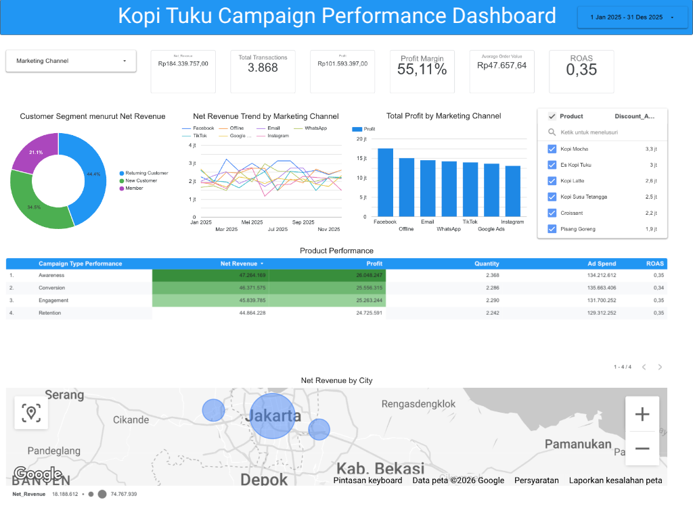

# Kopi Tuku — Campaign Performance Analysis

## Deskripsi Proyek

Proyek ini merupakan analisis performa campaign marketing **Kopi Tuku** selama periode **Januari – Desember 2025**. Dataset yang digunakan adalah data sintetis (dummy) yang dirancang untuk melatih kemampuan Data Analyst dalam proses **data cleaning, EDA, KPI analysis, dan pembuatan dashboard**.

Dataset mencakup informasi transaksi penjualan, campaign marketing, channel pemasaran, segmentasi pelanggan, dan metrik performa iklan.

---

## Tujuan Analisis

1. Membersihkan data mentah yang memiliki berbagai masalah kualitas data
2. Menganalisis performa campaign berdasarkan channel, tipe campaign, kota, produk, dan segmen pelanggan
3. Menghitung KPI utama bisnis (Revenue, Profit, ROAS, AOV, CTR, Conversion Rate)
4. Membuat dashboard interaktif untuk memvisualisasikan hasil analisis

---

## Dataset

| File | Deskripsi |
|:-----|:----------|
| `Dataset_raw.xlsx` | Dataset mentah sebanyak 6.100 baris dengan berbagai masalah kualitas data |
| `Dataset_Clean.xlsx` | Dataset bersih sebanyak 4.064 baris beserta sheet summary |
| `Kopi_Tuku_Dashboard.pdf` | Export dashboard dalam format PDF |
| `dashboard_preview.png` | Preview gambar dashboard |

### Kolom Dataset

| Kolom | Deskripsi |
|:------|:----------|
| `Transaction_ID` | ID transaksi unik |
| `Transaction_Date` | Tanggal transaksi; format sengaja dibuat tidak konsisten |
| `City` | Kota |
| `Campaign_Name` | Nama campaign |
| `Campaign_Type` | Tipe campaign (Awareness, Conversion, Engagement, Retention) |
| `Marketing_Channel` | Channel marketing (Facebook, Instagram, TikTok, Email, dll.) |
| `Product` | Nama produk |
| `Size` | Ukuran produk (Regular, Large) |
| `Customer_Segment` | Segmen pelanggan |
| `Payment_Method` | Metode pembayaran |
| `Quantity` | Jumlah item per transaksi |
| `Discount_Pct` | Persentase diskon (%) |
| `Ad_Spend` | Biaya iklan (Rp) |
| `Impressions` | Jumlah tayangan iklan |
| `Clicks` | Jumlah klik iklan |
| `Leads` | Jumlah leads yang dihasilkan |
| `Conversions` | Jumlah konversi |
| `Unit_Price` | Harga satuan produk (Rp) |
| `Gross_Revenue` | Pendapatan kotor sebelum diskon |
| `Discount_Amount` | Nilai potongan diskon |
| `Net_Revenue` | Pendapatan bersih setelah diskon |
| `COGS` | Cost of Goods Sold |
| `Profit` | Keuntungan bersih |
| `ROAS` | Return on Ad Spend |

---

## Proses Data Cleaning

Dataset mentah mengandung berbagai masalah kualitas data yang umum ditemui pada data dunia nyata. Berikut tahapan cleaning yang dilakukan:

### 1. Menghapus Data Duplikat

Data duplikat ditemukan dan dihapus untuk memastikan setiap transaksi hanya tercatat satu kali.

- **100 baris** duplikat exact berhasil dihapus

### 2. Menghapus Record Tidak Valid

Record yang memiliki nilai tidak masuk akal (misalnya quantity negatif, harga nol, atau data dasar yang tidak lengkap) dihapus dari dataset.

- **284 baris** record invalid (basic) dihapus
- **1.652 baris** record invalid (funnel) dihapus — yaitu record yang memiliki inkonsistensi pada metrik funnel (Impressions → Clicks → Leads → Conversions)

### 3. Menangani Missing Values

Missing values ditangani dengan pendekatan berbeda berdasarkan tipe data:

- **Kolom kategorikal** (City, Product, Campaign_Name, dll.) → diisi dengan **modus** (nilai yang paling sering muncul)
- **Kolom numerik** (Ad_Spend, Impressions, Unit_Price, dll.) → diisi dengan **median**

### 4. Memperbaiki Format Tanggal

Kolom `Transaction_Date` pada dataset mentah sengaja dibuat dengan format yang tidak konsisten. Format tanggal diseragamkan ke format standar **YYYY-MM-DD**.

### 5. Menyeragamkan Teks

Fitur **Find and Replace** digunakan untuk menyeragamkan singkatan dan penamaan kategori agar konsisten.

Contoh:
- Menyeragamkan penulisan nama kota
- Menyeragamkan nama channel marketing
- Menyeragamkan nama produk

### 6. Menghitung Ulang Metrik Turunan

Setelah data dibersihkan, metrik turunan dihitung ulang untuk memastikan konsistensi:

- `Gross_Revenue` = Quantity × Unit_Price
- `Discount_Amount` = Gross_Revenue × Discount_Pct / 100
- `Net_Revenue` = Gross_Revenue − Discount_Amount
- `COGS` = Net_Revenue × ~45% (estimasi)
- `Profit` = Net_Revenue − COGS
- `ROAS` = Net_Revenue / Ad_Spend
- `CTR` = Clicks / Impressions
- `Lead_Rate` = Leads / Clicks
- `Conversion_Rate` = Conversions / Leads
- `AOV` = Net_Revenue / Order_Count

### Ringkasan Hasil Cleaning

| Tahap | Jumlah Baris |
|:------|-------------:|
| Data mentah awal | 6.100 |
| Setelah hapus duplikat | 6.000 |
| Setelah hapus record invalid (basic) | 5.716 |
| Setelah hapus record invalid (funnel) | 4.064 |
| **Dataset final** | **4.064** |

---

## DASBOR

---

## Insight Utama

### Customer Segment berdasarkan Net Revenue

| Segment | Proporsi |
|:--------|:--------:|
| Returning Customer | 44,4% |
| New Customer | 34,5% |
| Member | 21,1% |

Returning Customer mendominasi revenue, menunjukkan loyalitas pelanggan yang kuat. Program membership perlu ditingkatkan karena kontribusi Member masih rendah.

### Top Marketing Channel berdasarkan Profit

| Channel | Profit | ROAS |
|:--------|-------:|:----:|
| Facebook | Rp 18,3 Jt | 0,34 |
| Offline | Rp 15,5 Jt | 0,36 |
| WhatsApp | Rp 15,1 Jt | 0,36 |
| Email | Rp 15,1 Jt | 0,35 |
| TikTok | Rp 14,6 Jt | 0,33 |
| Google Ads | Rp 14,4 Jt | 0,35 |
| Instagram | Rp 13,8 Jt | 0,36 |

Facebook menghasilkan profit tertinggi namun ROAS-nya lebih rendah dibanding Instagram dan Offline yang lebih efisien secara biaya iklan.

### Campaign Type Performance

| Campaign Type | Net Revenue | Profit | Quantity | Ad Spend | ROAS |
|:--------------|------------:|-------:|---------:|---------:|:----:|
| Awareness | Rp 47.284.169 | Rp 26.048.247 | 2.368 | Rp 134.212.612 | 0,35 |
| Conversion | Rp 46.371.575 | Rp 25.556.315 | 2.286 | Rp 135.663.406 | 0,34 |
| Engagement | Rp 45.839.785 | Rp 25.263.244 | 2.290 | Rp 131.700.252 | 0,35 |
| Retention | Rp 44.864.228 | Rp 24.725.591 | 2.242 | Rp 129.312.252 | 0,35 |

Semua tipe campaign menunjukkan performa yang relatif seimbang. Campaign Awareness unggul tipis dari sisi revenue dan profit.

### Top Products berdasarkan Discount Amount

| Produk | Discount Amount |
|:-------|----------------:|
| Kopi Mocha | Rp 3,3 Jt |
| Es Kopi Tuku | Rp 3,0 Jt |
| Kopi Latte | Rp 2,6 Jt |
| Kopi Susu Tetangga | Rp 2,5 Jt |
| Croissant | Rp 2,2 Jt |
| Pisang Goreng | Rp 1,9 Jt |

### Net Revenue by City

Jakarta menjadi kota dengan kontribusi Net Revenue tertinggi, diikuti oleh area Jabodetabek lainnya (Bekasi, Tangerang, Depok, Bogor) dan Bandung.

---

## KPI Summary

| KPI | Nilai |
|:----|------:|
| Net Revenue | Rp 184.339.757 |
| Total Transactions | 3.868 |
| Profit | Rp 101.593.397 |
| Profit Margin | 55,11% |
| Average Order Value (AOV) | Rp 47.657,64 |
| ROAS | 0,35 |
| Total Ad Spend | Rp 558.122.544 |
| CTR | 10,4% |
| Conversion Rate | 25,29% |

---

## Tools yang Digunakan

| Tool | Fungsi |
|:-----|:-------|
| **Google Sheets / Excel** | Data exploration dan basic cleaning |
| **Python (Pandas)** | Data cleaning, transformasi, dan analisis |
| **Google Looker Studio** | Dashboard dan visualisasi interaktif |
| **GitHub** | Version control dan portfolio hosting |

---

## Author

**Rizal Indriawan**
